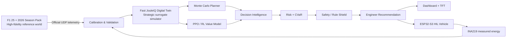
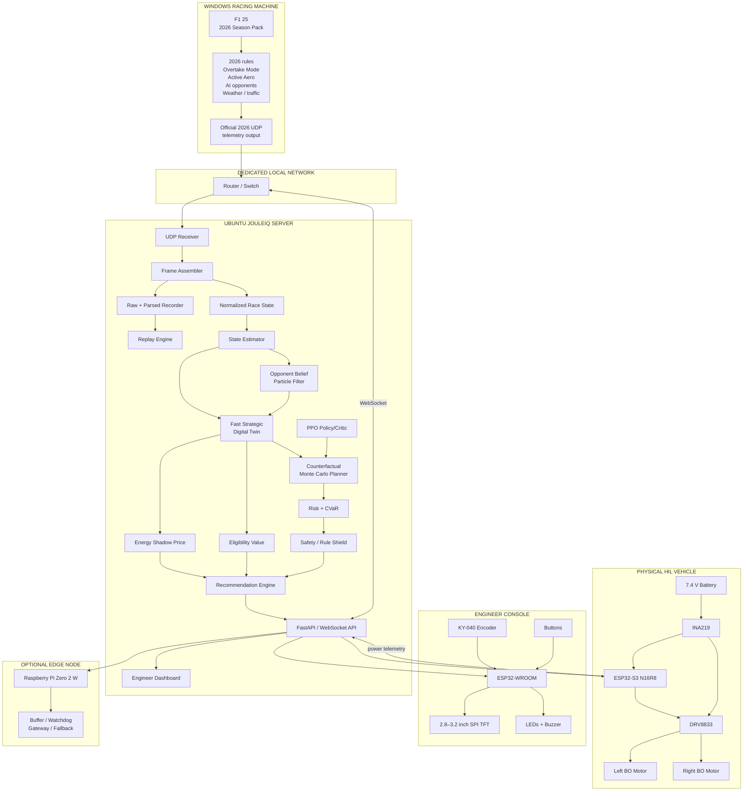
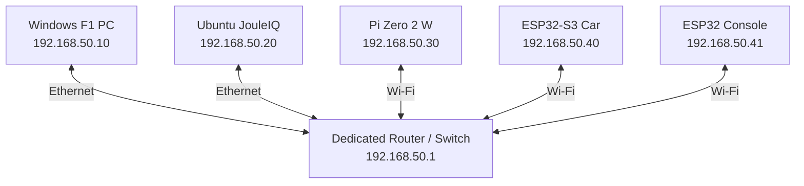
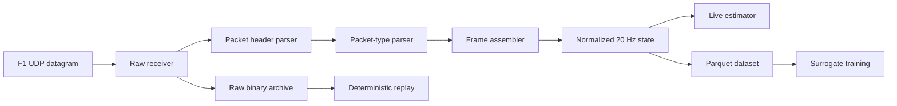
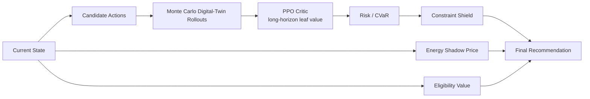
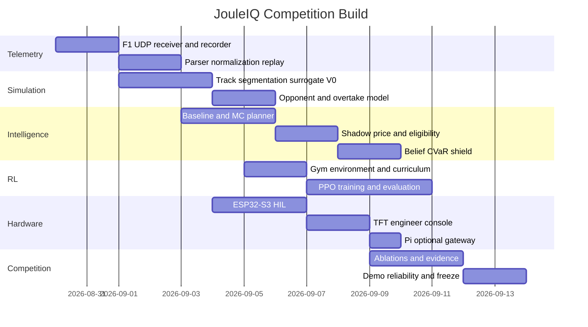

# JouleIQ: Competition-Ready Build Plan for an Energy- and Overtake-Aware Race Intelligence System

## Executive summary

**JouleIQ should not be presented as “RL controlling an F1 car.”** The strongest and most defensible product is a **real-time race-intelligence system that continuously prices the future value of electrical energy, evaluates overtaking opportunities under uncertainty, and tells an engineer whether to conserve, pressure, attack, defend, or deliberately spend energy to become eligible for a better future attack.**

The architecture should have three deliberately different levels of fidelity:



F1 25's 2026 expansion is unusually useful for this project because EA implemented **2026 cars, Overtake Mode and active aerodynamics**, and publishes a dedicated **2026 UDP telemetry specification**, currently Version 10.0. EA describes Overtake Mode in the game as unlocking when the player is within one second at a Detection Line and then being usable later in the lap subject to available stored energy. That threshold effect is almost exactly the strategic nonlinear decision JouleIQ is intended to optimize.

The important technical boundary is that F1 25 is a **telemetry-producing high-fidelity reference environment**, not our programmable RL environment. EA documents UDP telemetry output and selectable telemetry formats; it does not document a Gym-style external API offering `reset()`, `step(action)`, state cloning, or thousands of counterfactual rollouts. Therefore, F1 25 should calibrate and validate a much faster strategic surrogate, while the custom simulator handles millions of RL interactions and live Monte Carlo futures.

The live intelligence should follow:

> **F1 state → state estimation → opponent belief → candidate actions → fast counterfactual futures → RL long-horizon value → risk adjustment → safety shield → recommendation**

The physical car should prove a different claim:

> **The same software recommendation can command a real electrical system, and its actual energy consumption can be measured and integrated in joules.**

Your existing hardware inventory already contains the important embedded foundation: a DRV8833, 7.4 V/1200 mAh battery pack with BMS, ESP32-S3 N16R8, two ESP32-WROOM boards, Ethernet adapter, breadboards, jumper wiring, buttons, two KY-040 rotary encoders, LEDs, buzzers and assembly/debugging equipment. The architecture also matches the stronger advisory concept developed earlier: centralized/offline training, trackside inference, small deterministic edge behavior and human-facing recommendations rather than unconstrained live RL exploration.

The **competition-winning differentiator is not simply that JouleIQ uses RL**. It is the combination of:

**F1 25 2026 telemetry + calibrated digital twin + counterfactual planning + Energy Shadow Price + Eligibility Value + hidden-opponent belief + risk-aware CVaR + RL value estimation + real HIL energy measurement + human-readable explanations.**

That gives judges something visually impressive **and** something technically defensible.

### What “winning” should mean quantitatively

These are engineering targets for the project, not promises about F1 performance:

| Category | Competition gate |
|---|---|
| Telemetry | Stable F1 → Ubuntu ingest for an entire demo session with no parser crash |
| Replay | Any recorded session can reproduce the live dashboard deterministically |
| Simulator fidelity | Held-out segment-time MAE target `< 50 ms`; energy-transition error target `< 5%` where the game exposes suitable data |
| Strategy | Full JouleIQ beats the strongest scripted baseline on mean race utility with paired confidence interval above zero |
| Risk | Full JouleIQ improves mean outcome without materially worsening worst-tail/CVaR outcome |
| Safety | Zero hard-constraint violations in at least 10,000 evaluation episodes |
| Decision latency | Target p95 `< 200 ms` for a normal advisory decision on the Ubuntu machine |
| HIL | Every command produces an acknowledged ESP32 response and measurable INA219 energy trace |
| Failure handling | Disconnect F1, Ubuntu, ESP32 or TFT separately without destroying the demo |
| Explainability | Every recommendation shows action, energy cost, expected gain, risk, confidence, TTL and one-sentence reason |
| Demo | One visible scenario where greedy ATTACK loses to strategic HOLD/PRESSURE because future energy is more valuable |

The strategy evaluation should use **paired random seeds/scenarios**, not screenshots of cherry-picked races. The original PPO paper motivates PPO as a comparatively simple policy-gradient method using repeated minibatch optimization of a surrogate objective, while Gymnasium explicitly supports custom environments, vectorized instances and environment checking - all useful properties for our simulator design.

## Complete product architecture and hardware blueprint

### End-to-end system

This is the architecture I would lock and stop changing:



EA officially provides the 2026 UDP telemetry format and lets an existing F1 25 installation switch manually into that mode; new installations receive the 2026 format by default when using the corresponding content. The official specification page was updated to Version 10.0 and includes both the PDF and a C-like “2026 Season Pack Telemetry Output Structures” attachment.

### Why the device split is correct

The **Windows machine** should do almost nothing except run F1 25. Steam currently lists F1 25's PC minimum as Windows 10 64-bit, 8 GB RAM, DirectX 12 and a GTX 1060 6 GB/RX 570 8 GB-class GPU, with 100 GB storage; its recommended configuration calls for 16 GB RAM and stronger graphics.

The **Ubuntu laptop** is the main intelligence machine. Keep RL training, surrogate simulation, Monte Carlo, dashboard, recording and replay here.

The **ESP32-S3** is ideal for the HIL controller rather than ML training. Espressif specifies the S3 as a dual-core Xtensa LX7 MCU up to 240 MHz with 512 KB internal SRAM, integrated 2.4 GHz Wi-Fi/Bluetooth LE and peripherals including SPI, I2C and PWM.

The **Pi Zero 2 W is not the main AI server**. Its 1 GHz quad-core Cortex-A53 and 512 MB RAM are perfectly adequate for light gateway, buffering, logging and watchdog jobs, but the Ubuntu machine is the better home for simulation and training.

### Hardware bill of materials

Your uploaded purchase inventory establishes most of the electronics and tools as already acquired. The later motor/chassis items are also currently listed by MakerBazar; for example, the 150 RPM BO motor is ₹52, 65×28 mm BO wheel ₹22, and the 2WD metal chassis with integrated caster ₹79 at the pages checked for this report.

| Item | Exact qty | Status / use | Purchase or reference link |
|---|---:|---|---|
| ESP32-S3-WROOM-1 N16R8 development board | **1** | Owned; HIL vehicle MCU | [MakerBazar ESP32-S3](https://makerbazar.in/products/esp32-s3-wroom-development?variant=48251056881904) |
| ESP32-WROOM Type-C development board | **2** | Owned; one console, one spare/bridge | [MakerBazar ESP32-WROOM](https://makerbazar.in/products/esp32-wroom-wifi-ble-bluetooth-iot-node-mcu-board?variant=48251049935088) |
| DRV8833 dual H-bridge | **1** | Owned; both motors | [MakerBazar DRV8833](https://makerbazar.in/products/drv8833-2-channel-dc-motor-driver?variant=50036257718512) |
| 7.4 V / 1200 mAh 2S pack with BMS | **1** | Owned; HIL vehicle | [MakerBazar battery](https://makerbazar.in/products/rechargeable-lithium-ion-cells-battery-pack?variant=45095528399088) |
| Separate 2S 10 A BMS | **1** | Owned but normally unnecessary because battery already has BMS | [MakerBazar BMS](https://makerbazar.in/products/18650-bms-lithium-battery-protection-board?variant=48251032961264) |
| INA219 power monitor module | **1** | Available; high-side HIL measurement | [TI INA219 reference](https://www.ti.com/product/INA219) |
| 150 RPM single-shaft BO motors | **2** | Available; propulsion | [MakerBazar 150 RPM motor](https://makerbazar.in/products/bo-motor-single-shaft) |
| 65×28 mm BO wheels | **2** | Available | [MakerBazar BO wheel](https://makerbazar.in/products/small-wheel-for-bo-motor) |
| 2WD metal chassis + caster | **1** | Available | [MakerBazar chassis](https://makerbazar.in/products/caster-wheel-metal-chassis-for-diy-robot-car) |
| Adjustable LM2596 buck converter | **1** | Required/assumed acquired; battery → logic rail | [MakerBazar LM2596](https://makerbazar.in/products/lm2596-dc-dc-converter-step-down-module) |
| 2S / 8.4 V Li-ion charger | **1** | Required/assumed acquired | [MakerBazar TP5100](https://makerbazar.in/products/tp5100-4-2v-and-8-4v-dual-one-two-battery-protection-board) |
| Main vehicle power switch | **1** | Required | Existing/acquired equivalent |
| SPI TFT, preferably 2.8" 240×320 ILI9341 | **1** | Arrange; non-touch is sufficient | [KTRON ILI9341 TFT](https://www.ktron.in/product/2-8-inch-tft-lcd-non-touch-screen-module-240x320-resolution-spi-interface/) |
| KY-040 rotary encoder | **2** | Owned; only one required on final console | [MakerBazar inventory source in uploaded cart](https://makerbazar.in/products/360-degrees-rotary-encoder-module-brick-sensor-switch-development-ky-040) |
| Pushbuttons | **4** | Owned; What-If, Override, mode/reset functions | [MakerBazar PBS-110](https://makerbazar.in/products/pbs-110-momentary-push-button-switch) |
| LEDs | **20 each × 4 colours** | Owned; only ~4 used | [MakerBazar LEDs](https://makerbazar.in/products/5mm-round-top-clear-diffused-type) |
| Active buzzer modules | **2** | Owned; one console alert | [MakerBazar buzzer](https://makerbazar.in/products/high-current-active-alarm-buzzer-driver-module) |
| 330 Ω resistors | **20** | Owned; LEDs | [MakerBazar resistors](https://makerbazar.in/products/carbon-film-resistor-dip-1-4-watt-resistance-through-hole-1-to-999ohm) |
| General resistor assortment | **1 box** | Owned | [MakerBazar assortment](https://makerbazar.in/products/multiple-resistances) |
| F-F jumper ribbon | **1 × 40** | Owned | [MakerBazar jumpers](https://makerbazar.in/products/jumper-cable-male-female) |
| M-F jumper ribbon | **1 × 40** | Owned | Same |
| M-M jumper ribbon | **1 × 40** | Owned | Same |
| Breadboards | **2** | Owned | [MakerBazar breadboards](https://makerbazar.in/products/solderless-800-pin-breadboard) |
| Dot prototype PCBs | **2** | Owned | [MakerBazar dot PCB](https://makerbazar.in/products/single-sided-pcb-universal-prototype-circuit-board) |
| USB-A → USB-C cables | **2** | Owned | [MakerBazar cable](https://makerbazar.in/products/portronics-usb-a-to-type-c-data-cable) |
| USB/Ethernet adapter | **1** | Owned; useful for wired Ubuntu | [MakerBazar adapter](https://makerbazar.in/products/usb-ethernet-adapter) |
| Multimeter | **1** | Owned | [MakerBazar DT830D](https://makerbazar.in/products/dt830d-digital-multimeter) |
| Raspberry Pi Zero 2 W | **1** | Arrange; optional gateway/fallback | [Official Raspberry Pi Zero 2 W](https://www.raspberrypi.com/products/raspberry-pi-zero-2-w/) |
| microSD card for Pi | **1** | Required only once Pi arrives | Any reputable 16–32 GB+ card |
| 5 V micro-USB Pi supply | **1** | Required only once Pi arrives | Official-compatible supply |
| Windows PC | **1** | Existing; F1 25 host | - |
| Ubuntu laptop | **1** | Existing; JouleIQ server | - |
| Local router/AP/switch | **1** | Existing preferred | - |
| F1 25 + 2026 Season Pack license | **1** | Software calibration/demo environment | [Steam Season Edition](https://store.steampowered.com/sub/1453566/) |

The TI DRV8833 itself supports two brushed DC motors from a 2.7–10.8 V motor supply. TI quotes up to 1.5 A RMS and 2 A peak per bridge for certain package variants, while the lower-power PW package has a lower continuous rating; because your inexpensive breakout's exact IC package and thermal design should not be assumed, **measure real startup current and driver temperature instead of treating “2 A” as a guaranteed board-level continuous capability**.

The INA219 is electrically appropriate for this low-voltage HIL system: TI specifies a 0–26 V common-mode measurement range and I2C digital interface. The exact current range of your breakout, however, also depends on the board's shunt resistor and thermal design, so calibrate the actual module rather than assuming every INA219 breakout has the same current limit.

The uploaded MakerBazar cart totals approximately **₹4,934 from its listed line totals**, before the later motors/wheels/chassis/INA219/TFT/Pi and other later purchases. At the current pages checked, two motors + two wheels + chassis + LM2596 + TP5100 correspond to approximately ₹345 before shipping. Steam currently lists the full **F1 25: 2026 Season Edition at US$49.99**, or the expansion alone at US$24.99 if F1 25 is already owned.

### HIL electrical layout

```text
               7.4 V / 2S BATTERY
                       │
                 MAIN SWITCH
                       │
                    INA219
               VIN+  ───  VIN-
                       │
             ┌─────────┴──────────┐
             │                    │
             ▼                    ▼
          DRV8833              LM2596
            VM                    │
       ┌─────┴─────┐             5 V
       │           │              │
    Motor L     Motor R        ESP32-S3
       ▲           ▲              │
       └─────┬─────┘              │
             │                  3.3 V
          PWM/GPIO                 │
             └─────────────────────┘
                                  │
                         I2C SDA / SCL
                                  │
                               INA219

ALL LOGIC/MOTOR GROUNDS COMMON
```

Set the LM2596 output **with the multimeter before connecting the ESP32**. Feed an appropriate regulated input to the dev board's supported 5 V/VIN path, not the MCU's 3.3 V pin unless the exact board documentation specifically calls for it. The LM2596 module currently sold by MakerBazar is adjustable, so its output should never be assumed from the factory potentiometer position.

For INA219 communications, use ESP32-S3 I2C. Espressif's documentation supports standard and fast I2C operation up to 400 kHz and notes the normal need for appropriate external pull-ups; many INA219 modules already include them, which should be checked visually or electrically before adding another set.

For the DRV8833, use four logic channels:

```text
ESP32-S3
 ├── LEFT_IN1  ──► AIN1
 ├── LEFT_IN2  ──► AIN2
 ├── RIGHT_IN1 ──► BIN1
 └── RIGHT_IN2 ──► BIN2
```

Use ESP32 LEDC or MCPWM rather than bit-banging motor PWM. The S3's LEDC peripheral provides multiple hardware PWM channels whose duty cycle can be updated by software.

Because you do **not** currently have wheel encoders, do not claim closed-loop speed control. The physical car is an **open-loop power-mode and energy-measurement demonstrator**. Manually calibrate left/right PWM trim so the car approximately travels straight.

Initial HIL mappings can be:

| JouleIQ mode | Initial left/right target | Physical interpretation |
|---|---:|---|
| CONSERVE | 40% PWM | Lowest-power demonstration |
| HOLD | 55% | Nominal |
| PRESSURE | 70% | Moderate deployment |
| ELIGIBILITY PUSH | 82% | Short tactical push |
| DEFEND | 85% | High deployment |
| ATTACK | 95% | Maximum normal demo deployment |
| STOP | 0% | HIL safety state |

Those percentages are **starting calibration values**, not motor specifications. After measuring current, straight-line bias and driver temperature, store calibrated values in `hardware/calibration.yaml`.

A stale network command must cause **STOP**, not HOLD. In software race strategy “HOLD” is a valid tactical policy; in a small robot with lost communications, continuing to drive is not a safe fail state.

### Network topology

Use wired Ethernet between the important computers if possible:



These are **our chosen project addresses**, not F1 requirements. Use DHCP reservations if the router handles them more reliably than hard-coded static addressing.

Send F1 telemetry directly from Windows to `192.168.50.20`. The ESP32-S3 supports Wi-Fi station mode, and Espressif's networking documentation emphasizes proper disconnect/error-recovery handling - important for a live demo.

Do not insert the Pi in the critical data path initially. Once it arrives, add it as an **observer and fallback**, not:

```text
F1 → Pi → Ubuntu → Pi → ESP32
```

which unnecessarily creates two extra failure points.

## Simulation, F1 calibration, reinforcement learning and surrogate design

### The two-simulator strategy

JouleIQ has:

```text
F1 25 2026
HIGH FIDELITY / SLOW / BLACK-BOXISH
           │
           │ telemetry experiments
           ▼
CALIBRATION DATASET
           │
           ▼
JOULEIQ FAST DIGITAL TWIN
LOWER FIDELITY / FAST / FULLY PROGRAMMABLE
           │
      ┌────┴────┐
      ▼         ▼
     PPO    Monte Carlo
      │         │
      └────┬────┘
           ▼
      JouleIQ policy
           │
           ▼
    validate in F1 25
```

Do not call F1 25 “ground truth Formula 1 physics.” It is a consumer simulation/game. The accurate claim is:

> **JouleIQ's strategic surrogate is calibrated and validated against the official F1 game's 2026 simulation and telemetry interface.**

EA states that the 2026 Season Pack implements the new cars, Overtake Mode and active aerodynamics.

For the competition build, **do not use game mods, memory injection or automation hooks**. Use EA's supported UDP output only. This minimizes integration risk and keeps the Windows environment clean. Steam notes that the game/package uses EA Javelin anti-cheat, another reason not to build the critical demo around invasive game modification.

### Choice of demonstration circuit

Start calibration on **one circuit only**.

I would use **Monza** as the primary engineering/demo circuit because its long straights and major braking events make energy deployment/harvesting explanations intuitive. After the full pipeline works, MADRING can become an optional 2026-specific second track.

I would **not make Spa the competition-critical circuit right now**: EA's August 27, 2026 issue tracker lists a currently awaiting-update problem where Overtake Mode can become unavailable on the following lap at Spa. EA's current issue page also reports v1.24 as live.

### F1 UDP data pipeline



Capture at minimum the official packet groups corresponding to:

| Data group | Fields JouleIQ should retain |
|---|---|
| Header | session UID, session time, packet ID, packet version, frame identifiers, player-car index |
| Session | circuit/session, weather, total laps, safety/race state |
| Lap Data | lap, lap distance, car position, timing, sector, pit/driver state |
| Motion | position/orientation/velocity signals needed for track segmentation |
| Car Telemetry | speed, throttle, brake, steering, gear, engine RPM |
| Car Status | ERS/energy state and other relevant car-status variables exposed by the current spec |
| Car Telemetry 2 | 2026 Overtake and active-aero state/availability/activation information |
| Event | race events/overtake events as exposed |
| Participants | vehicle identities for gap/opponent association |
| Car Damage | optional reliability/context features |
| Session History | offline lap/sector consistency checks |

Use the **current Version 10.0 EA attachment as the authoritative binary layout**, not a blog parser copied from an earlier F1 game.

### Exact Ubuntu UDP sanity commands

Determine the Ubuntu address:

```bash
ip -br addr
```

Allow our selected UDP port:

```bash
sudo ufw allow 20777/udp
```

Check that F1 datagrams arrive:

```bash
sudo tcpdump -ni any udp port 20777
```

On the Windows F1 machine configure:

```text
UDP Telemetry:       ON
UDP target IP:       <Ubuntu LAN IP>
Project UDP port:    20777
UDP mode/format:     F1 25: 2026 Season Pack
```

EA explicitly documents selecting the 2026 UDP mode through the game's telemetry settings.

A minimal Ubuntu receiver:

Follow the exact current EA 2026 telemetry structure attachment. The common header occupies 29 bytes in this layout.

```python
#!/usr/bin/env python3
"""F1 UDP connectivity probe.

This does not try to interpret packet bodies. It verifies datagram
delivery and extracts the common packet header.
"""

from __future__ import annotations

import socket
import struct
import time

HOST = "0.0.0.0"
PORT = 20777

HEADER = struct.Struct("<HBBBBBQfIIBB")

FIELD_NAMES = (
    "packet_format",
    "game_year",
    "game_major_version",
    "game_minor_version",
    "packet_version",
    "packet_id",
    "session_uid",
    "session_time",
    "frame_identifier",
    "overall_frame_identifier",
    "player_car_index",
    "secondary_player_car_index",
)


def main() -> None:
    sock = socket.socket(socket.AF_INET, socket.SOCK_DGRAM)
    sock.bind((HOST, PORT))
    sock.settimeout(5.0)

    print(f"Listening for F1 telemetry on UDP {HOST}:{PORT}")

    while True:
        try:
            data, sender = sock.recvfrom(65535)
        except socket.timeout:
            print("No packet for 5 seconds.")
            continue

        if len(data) < HEADER.size:
            print(f"Discarded short datagram: {len(data)} bytes")
            continue

        values = HEADER.unpack_from(data)
        header = dict(zip(FIELD_NAMES, values))

        print(
            f"{time.time():.3f} "
            f"src={sender[0]} "
            f"bytes={len(data)} "
            f"packet_id={header['packet_id']} "
            f"frame={header['frame_identifier']} "
            f"session={header['session_uid']}"
        )


if __name__ == "__main__":
    main()
```

The critical rule is to verify this common header and **generate/implement every body structure from EA's current Version 10.0 structure file**. Do not assume that an F1 23/24/25 package has matching body offsets.

### Raw packet recorder

Save the original datagrams in addition to decoded tables. That means you can fix a parser later without having to redrive the race:

```python
import socket
import struct
import time
from pathlib import Path

PORT = 20777
OUT = Path("data/raw/f1_udp.bin")
OUT.parent.mkdir(parents=True, exist_ok=True)

sock = socket.socket(socket.AF_INET, socket.SOCK_DGRAM)
sock.bind(("0.0.0.0", PORT))

with OUT.open("ab") as f:
    while True:
        data, _ = sock.recvfrom(65535)

        # Framing:
        # uint64 timestamp_ns
        # uint16 datagram_length
        # raw datagram bytes
        f.write(struct.pack("<QH", time.time_ns(), len(data)))
        f.write(data)
        f.flush()
```

That binary log becomes your competition fallback:

```text
F1 live unavailable
       ↓
load recorded UDP stream
       ↓
replay with original timestamps
       ↓
whole JouleIQ stack still operates
```

The dashboard should visibly display **LIVE** or **REPLAY**. Never disguise a replay as live.

### Normalized state

Do not let EA packet structures leak throughout your planning code. Convert them into one internal schema:

```python
@dataclass(frozen=True)
class RaceState:
    timestamp_ns: int
    session_uid: int

    lap: int
    lap_progress: float
    laps_remaining: int
    position: int

    speed_mps: float
    throttle: float
    brake: float
    gear: int

    energy_frac: float
    deployed_energy_j: float
    harvested_energy_j: float

    gap_front_s: float
    gap_back_s: float
    closing_rate_front: float

    overtake_available: bool
    overtake_active: bool
    distance_to_overtake_m: float

    active_aero_available: bool
    active_aero_state: int

    safety_state: int
    telemetry_age_s: float
```

Anything unavailable becomes `None`/mask data instead of a fake zero.

### F1 calibration experiments

You are not trying to identify every mechanical parameter of an F1 car. Identify the **decision consequences**.

**Energy-response experiment.** Fix circuit, setup, weather and tyre/fuel conditions as closely as practical. Repeatedly cross the same strategic segments at several ERS/deployment behaviors. Store entry state, energy before/after, speed trace, exit state and segment time. Repeat enough runs that human-input variance can be separated from energy effect.

**Harvest experiment.** For braking segments, collect entry velocity, brake trace, energy before/after and segment duration. Fit expected recovered energy and residual uncertainty.

**Eligibility experiment.** In race sessions, approach Detection Lines at several gaps around the game's one-second threshold, record Overtake availability and downstream outcome. EA explicitly describes the game's one-second detection logic and the ability to deploy the unlocked Overtake boost later in that lap if sufficient battery remains.

**Active-aero experiment.** Record segment time and energy interactions in active-aero zones with identical surrounding conditions as far as practical.

**Opponent experiment.** Follow AI cars at varying gaps, tyre/pace conditions and available-energy states and build examples of closing, failed attacks, passes and defensive responses.

**Domain-randomization experiment.** Later vary weather, tyre state, setup and AI strength to estimate model uncertainty instead of pretending one fitted curve applies everywhere.

Use full **sessions/laps as train/validation/test units**, not random telemetry rows. Random-row splitting would leak almost identical neighboring samples into both training and validation and give falsely optimistic errors.

### Track segmentation

Start with around **60–100 strategic segments**.

Each segment should represent a meaningful decision region rather than equal milliseconds:

```python
@dataclass
class TrackSegment:
    id: int
    start_m: float
    end_m: float

    kind: str  # straight, braking, corner, exit
    baseline_time_s: float

    energy_sensitivity: float
    harvest_potential: float
    overtaking_score: float

    detection_zone: bool
    activation_zone: bool
    active_aero_zone: bool
```

Circuit representation:

```text
braking
  ↓
corner
  ↓
exit
  ↓
straight
  ↓
DETECTION
  ↓
pre-attack segment
  ↓
OVERTAKE / ACTIVE-AERO region
  ↓
braking / harvest
```

The simulator state advances **one strategic segment per step**, not every 20 ms. That is what allows large-scale RL and Monte Carlo.

### Core state transition model

Energy:

\[
E_{t+1}
=
\operatorname{clip}
\left(
E_t-e_{\text{deploy}}(s_t,a_t)+e_{\text{harvest}}(s_t),
0,E_{\max}
\right)
\]

Segment time:

\[
T_t =
f_{\text{seg}}
(
v_{\text{entry}},
E_t,
a_t,
\text{tyres},
\text{aero},
\text{traffic},
\text{weather}
)
+
\epsilon_t
\]

Gap:

\[
g_{t+1}
=
g_t + T_{\text{own},t}-T_{\text{opp},t}
\]

The important modeling target is not:

> “What is the exact aerodynamic drag coefficient?”

It is:

> “How much time and future strategic flexibility does deploying this amount of energy buy in this situation?”

### Surrogate model fitting

Build in increasing complexity:

| Stage | Model | Why |
|---|---|---|
| First | Segment lookup tables + linear interpolation | Transparent and nearly impossible to debug incorrectly |
| Next | Piecewise/monotonic response curves | Captures diminishing return of deployment |
| Next | Gradient-boosted residual model | Handles entry speed, tyres, aero, traffic interactions |
| Next | Bootstrap ensemble of 5 models | Gives epistemic uncertainty estimate |
| Only if necessary | Small neural surrogate | Use only if simpler models fail held-out accuracy |

A good decomposition is:

\[
T_{\text{pred}}
=
T_{\text{base segment}}
+
\Delta T_{\text{energy}}
+
\Delta T_{\text{tyre}}
+
\Delta T_{\text{traffic}}
+
\Delta T_{\text{aero}}
+
f_{\text{residual}}
\]

This is much easier to explain to judges than a single neural network that maps 40 variables directly to time.

### Gymnasium environment specification

Gymnasium's custom-environment interface requires the environment to define observation/action spaces and implement `reset()` and `step()` returning observation, reward, termination/truncation state and auxiliary information; it also provides `check_env` and vectorized environment creation.

Use a normalized 28-dimensional observation initially:

| Group | Inputs |
|---|---|
| Own car | energy fraction, previous deployment, tyre-age proxy, pace residual, normalized position, laps remaining |
| Track | lap progress, curvature proxy, base speed, harvest potential, overtaking score, distance to detection, distance to activation, eligibility, active-aero availability, safety/race state |
| Traffic | gap front, gap rear, relative front pace, closing rate |
| Opponent belief | P(low energy), P(medium), P(high), aggression estimate, belief entropy |
| Uncertainty | surrogate time sigma, energy sigma, telemetry age |

Action space:

```python
0 = CONSERVE
1 = HOLD
2 = PRESSURE
3 = ELIGIBILITY_PUSH
4 = ATTACK
5 = DEFEND
```

Minimal wrapper:

```python
from __future__ import annotations

import gymnasium as gym
import numpy as np
from gymnasium import spaces


class JouleIQEnv(gym.Env):
    metadata = {"render_modes": []}

    def __init__(self, simulator):
        super().__init__()
        self.sim = simulator

        self.action_space = spaces.Discrete(6)

        # All observations are pre-normalized / clipped.
        self.observation_space = spaces.Box(
            low=-5.0,
            high=5.0,
            shape=(28,),
            dtype=np.float32,
        )

    def _obs(self) -> np.ndarray:
        x = self.sim.observation_vector()
        x = np.asarray(x, dtype=np.float32)

        if x.shape != (28,):
            raise RuntimeError(f"Unexpected observation shape: {x.shape}")

        if not np.all(np.isfinite(x)):
            raise RuntimeError("Simulator emitted NaN/Inf observation")

        return np.clip(x, -5.0, 5.0)

    def reset(self, *, seed=None, options=None):
        super().reset(seed=seed)

        scenario = self.sim.sample_scenario(
            rng=self.np_random,
            options=options,
        )
        self.sim.reset(scenario)

        return self._obs(), self.sim.info()

    def step(self, action):
        if not self.action_space.contains(action):
            raise ValueError(f"Invalid action: {action}")

        result = self.sim.step(int(action), rng=self.np_random)

        reward = float(result.reward)
        terminated = bool(result.race_finished)
        truncated = bool(result.invalid_episode)

        return (
            self._obs(),
            reward,
            terminated,
            truncated,
            result.info,
        )
```

Then validate it:

```python
from gymnasium.utils.env_checker import check_env

env = JouleIQEnv(simulator)
check_env(env)
```

Gymnasium explicitly recommends environment checking and supports multiple environments in parallel.

### Reward

Do **not** write:

```text
+10 if overtake
```

That encourages spectacle rather than race outcome.

Use a race-value reward:

\[
r_t =
-\Delta t_{\text{relative}}
+w_p\Delta \text{position}
-w_vV_{\text{vulnerability}}
-w_cC_{\text{soft}}
\]

with terminal:

\[
R_T =
w_f U(\text{finish position})
-
w_E\max(0,E_{\text{target}}-E_T)
\]

Hardly any explicit “energy penalty” is needed: energy has value because consuming it changes future states. A large generic battery penalty would teach the agent to save energy even when deployment is strategically correct.

Hard illegal/impossible actions should preferably be **blocked by the safety shield**, not merely punished in reward.

### PPO starting configuration

PPO is a sensible first RL algorithm because it works with both discrete and continuous spaces and its clipped-surrogate approach is simple enough to reason about. Stable-Baselines3's current documentation uses defaults including learning rate `3e-4`, `n_steps=2048`, `n_epochs=10`, `gamma=0.99`, GAE lambda `0.95`, clip range `0.2`, value coefficient `0.5` and max gradient norm `0.5`.

For JouleIQ I would start from, but not blindly retain, those defaults:

```yaml
algorithm: PPO
policy: MlpPolicy

n_envs: 16
n_steps: 512
batch_size: 256
n_epochs: 10

learning_rate:
  start: 3.0e-4
  end: 3.0e-5
  schedule: linear

gamma: 0.995
gae_lambda: 0.95
clip_range: 0.20

ent_coef:
  start: 0.010
  end: 0.001

vf_coef: 0.50
max_grad_norm: 0.50
target_kl: 0.03

network:
  hidden_layers: [256, 256]
  activation: tanh

training_steps:
  initial_gate: 2_000_000
  full_sweep: 5_000_000
  stretch: 10_000_000

seeds: [11, 22, 33, 44, 55]
```

Those are **project starting values**, not universally optimal PPO hyperparameters. Tune based on held-out evaluation rather than training reward.

Training:

```python
from stable_baselines3 import PPO

model = PPO(
    "MlpPolicy",
    vec_env,
    learning_rate=3e-4,
    n_steps=512,
    batch_size=256,
    n_epochs=10,
    gamma=0.995,
    gae_lambda=0.95,
    clip_range=0.20,
    ent_coef=0.01,
    vf_coef=0.5,
    max_grad_norm=0.5,
    target_kl=0.03,
    policy_kwargs=dict(net_arch=[256, 256]),
    tensorboard_log="runs/ppo/",
    verbose=1,
    seed=11,
)

model.learn(total_timesteps=2_000_000)
model.save("models/jouleiq_ppo_seed11")
```

### Curriculum

Do not begin with full stochastic racing.

```text
CURRICULUM A
Single car
Finite energy
Learn where deployment is valuable
        ↓
CURRICULUM B
Deterministic opponent
Learn gap management
        ↓
CURRICULUM C
Eligibility / Overtake
Learn threshold effects
        ↓
CURRICULUM D
Opponent defense
Learn timing
        ↓
CURRICULUM E
Hidden opponent energy
Learn belief-aware strategy
        ↓
CURRICULUM F
Traffic / tyres / weather / randomness
Learn robustness
        ↓
CURRICULUM G
Track/domain randomization
Generalization
```

This also produces a strong judging slide:

> “Here is what the policy learned at each curriculum stage.”

## Decision intelligence: Monte Carlo, shadow pricing, eligibility, belief, risk and residual RL

### Why RL should not be the final decision maker

The strongest architecture is:



That makes RL **one source of long-horizon intelligence**, not an unquestionable black box.

The earlier system architecture you supplied reached the same broader conclusion: freeze race-time policies, use trackside inference and put constraints/human-readable recommendations around the learned component instead of allowing live exploration.

### Counterfactual planner

At each strategically important segment:

```text
CURRENT STATE
     │
     ├──── CONSERVE ───── 512 futures
     ├──── HOLD ───────── 512 futures
     ├──── PRESSURE ───── 512 futures
     ├──── ELIG PUSH ──── 512 futures
     ├──── ATTACK ─────── 512 futures
     └──── DEFEND ─────── 512 futures
```

Each rollout randomizes:

```text
opponent deployment
opponent aggression
future harvest
pace residual
pass success/failure
traffic
model residual
tyre variation
race events
```

Use the **same random-number samples across competing actions** where possible. That “common random numbers” technique makes comparisons less noisy because ATTACK and HOLD experience the same sampled opponent/weather future.

A practical planner:

```python
def evaluate_actions(state, actions, n_rollouts=512):
    seeds = make_common_seeds(n_rollouts)
    results = {}

    for action in actions:
        utilities = []

        for seed in seeds:
            future = twin.clone(state)
            rng = np.random.default_rng(seed)

            future.apply(action)

            for _ in range(ROLLOUT_HORIZON):
                future.advance_stochastically(rng)

            # PPO critic supplies long-horizon continuation value.
            leaf_value = rl_value_model(future.observation())
            utility = future.realized_utility() + leaf_value

            utilities.append(utility)

        results[action] = summarize_distribution(utilities)

    return results
```

Live computational optimization comes later:

```text
512 → 256 rollouts if latency high
skip impossible actions
early-stop clearly dominated candidates
vectorize simulation
batch PPO critic calls
cache repeated transition features
```

### Energy Shadow Price

This should be one of the project's signature outputs.

Let \(J(s,E)\) be estimated future race value given stored energy \(E\).

Compute:

\[
\lambda_E
\approx
\frac{
J(s,E+\delta)-J(s,E-\delta)
}{
2\delta
}
\]

Interpretation:

> **How valuable is one additional joule/kilojoule of usable energy in this race state?**

Example UI:

```text
ENERGY SHADOW PRICE

Current section             1.3 ms-equivalent / kJ
Next detection window       4.8 ms-equivalent / kJ
Later defense window        3.6 ms-equivalent / kJ
```

Now HOLD is explainable:

> “Save energy because its projected marginal value is 3.7× higher at the next attack window.”

You are no longer saying:

> “The neural network says HOLD.”

### Eligibility Value

EA's 2026 game implementation creates exactly the nonlinear effect we care about: being within one second at a Detection Line unlocks Overtake Mode for later use in the lap, subject to sufficient stored energy.

For each action estimate:

\[
P_{\text{elig}}(a)
=
P(g_{\text{detection}}\le 1.0s\mid a)
\]

Then:

\[
\Delta P_{\text{elig}}(a)
=
P_{\text{elig}}(a)-P_{\text{elig}}(\text{HOLD})
\]

Estimate the downstream value:

\[
V_{\text{elig}}
=
E[J\mid\text{eligible}]
-
E[J\mid\text{not eligible}]
\]

And net tactical value approximately:

\[
EV_{\text{elig-push}}
=
\Delta P_{\text{elig}}
\cdot V_{\text{elig}}
-
\lambda_E\Delta E
\]

This is an excellent demonstration because a small deployment may have a much larger effect than its immediate 0.1 s time gain.

Example:

```text
Gap now:                  1.06 s
Detection distance:       690 m

HOLD
Predicted eligibility:    34%

ELIGIBILITY PUSH
Energy:                    0.14 MJ
Predicted eligibility:    81%

Direct gain:               only 0.11 s
Strategic value:           HIGH
```

### Opponent belief model

Do **not** feed exact opponent stored energy to the strategic agent even if some offline data source makes it observable.

Treat rival energy as hidden:

```text
Opponent energy belief

LOW       46%
MEDIUM    42%
HIGH      12%
```

Use a small particle filter:

```text
Particle i
{
    opponent_energy,
    opponent_pace_bias,
    aggression,
    defense_bias
}
```

Every observed segment:

\[
w_i'
\propto
w_i
P(
\text{observed gap/acceleration/behavior}
\mid
x_i
)
\]

Then normalize/resample.

Initial implementation:

```text
256 particles
↓
propagate opponent energy
↓
predict opponent segment time
↓
compare with observed gap change
↓
likelihood weighting
↓
resample when effective sample size drops
```

Outputs:

```text
P(low / medium / high)
aggression estimate
defense estimate
belief entropy
```

The hidden-state approach also makes the project more realistic and prevents a judge from saying:

> “You're solving the problem by reading information the strategist shouldn't know.”

### CVaR risk engine

An average can hide bad outcomes.

Suppose:

```text
ATTACK
Mean outcome:       +0.39 position
Worst 10%:          -0.96

PRESSURE
Mean outcome:       +0.31
Worst 10%:          -0.18
```

A risk-neutral agent picks ATTACK.

A risk-aware championship situation might prefer PRESSURE.

CVaR is explicitly designed to focus on a distribution's adverse tail and has a history of use in risk-sensitive control and reinforcement learning.

For Monte Carlo utilities \(U_i\), calculate lower-tail CVaR:

```python
def lower_cvar(values, alpha=0.10):
    x = np.sort(np.asarray(values))
    n = max(1, int(np.ceil(alpha * len(x))))
    return float(x[:n].mean())
```

Then:

\[
\text{score}
=
E[U]
-
\kappa
\left(E[U]-CVaR_{0.10}(U)\right)
\]

Engineer encoder:

| Mode | Initial risk penalty \(\kappa\) |
|---|---:|
| AGGRESSIVE | 0.20 |
| BALANCED | 0.50 |
| ROBUST | 0.90 |

Again, these values are tunable engineering settings.

### Confidence

Do not display PPO softmax probability as “confidence.”

Use empirical counterfactual support:

```text
Confidence =
percentage of bootstrap/Monte-Carlo evaluations
where selected action beats second-best action
```

So:

```text
Recommendation: PRESSURE
Confidence:     87%
```

actually has a meaning.

### Safety and rule shield

Two different shields are needed.

**Race/advisory shield:**

```text
telemetry stale?
race-state valid?
action available?
enough projected energy?
minimum terminal reserve feasible?
surrogate uncertainty acceptable?
Overtake available where required?
```

If not:

```text
recommend baseline map / HOLD
```

**Physical HIL shield:**

```text
command sequence valid?
command TTL valid?
Wi-Fi connected?
battery measurement valid?
PWM under calibrated limit?
driver fault?
```

If not:

```text
STOP MOTORS
```

The DRV8833 includes device-level overcurrent, short-circuit, undervoltage and over-temperature protection, but those should be the last hardware protection - not a substitute for application limits.

### Residual RL

Do this **after planner + PPO critic works**.

Version one:

```text
Planner chooses tactical action
PPO critic estimates future value
```

Version two:

```text
Planner nominal deployment u_nom
                │
                ▼
       RL correction Δu
        limited to ±0.15
                │
                ▼
u_proposed = u_nom + Δu
                │
                ▼
          Safety Shield
                │
                ▼
             u_final
```

Mathematically:

\[
u_{\text{final}}
=
\mathcal S
\left[
u_{\text{planner}}
+
\operatorname{clip}(\Delta u_{\text{RL}},-0.15,0.15)
\right]
\]

The tactical label is derived afterward:

```text
0.00–0.30   CONSERVE
0.30–0.50   HOLD
0.50–0.68   PRESSURE
0.68–0.82   ELIGIBILITY PUSH
0.82–1.00   ATTACK/DEFEND according to context
```

If residual RL is unstable, **remove it from the live decision path without removing PPO entirely**. Keep the critic as a leaf-value estimator. That is the correct contingency.

## Software stack, HIL firmware, interface, logging and validation

### Repository

Use one monorepo:

```text
jouleiq/
│
├── README.md
├── pyproject.toml
├── uv.lock
│
├── configs/
│   ├── system.yaml
│   ├── network.yaml
│   ├── tracks/
│   │   └── monza.yaml
│   ├── ppo_v1.yaml
│   └── hil_calibration.yaml
│
├── telemetry/
│   ├── f1/
│   │   ├── receiver.py
│   │   ├── header.py
│   │   ├── packets_2026.py
│   │   ├── parser.py
│   │   └── recorder.py
│   ├── normalize.py
│   └── replay.py
│
├── simulator/
│   ├── state.py
│   ├── track.py
│   ├── vehicle.py
│   ├── energy.py
│   ├── opponent.py
│   ├── interactions.py
│   ├── rules.py
│   ├── stochastic.py
│   └── race.py
│
├── surrogate/
│   ├── dataset.py
│   ├── segmenter.py
│   ├── fit_time.py
│   ├── fit_energy.py
│   ├── fit_overtake.py
│   └── uncertainty.py
│
├── env/
│   └── jouleiq_env.py
│
├── training/
│   ├── train_ppo.py
│   ├── curriculum.py
│   ├── callbacks.py
│   └── evaluate.py
│
├── intelligence/
│   ├── counterfactual.py
│   ├── shadow_price.py
│   ├── eligibility.py
│   ├── risk.py
│   ├── confidence.py
│   └── recommendation.py
│
├── belief/
│   └── opponent_filter.py
│
├── safety/
│   ├── race_shield.py
│   └── hil_shield.py
│
├── adaptation/
│   └── surrogate_calibration.py
│
├── api/
│   ├── main.py
│   ├── schemas.py
│   └── websocket.py
│
├── dashboard/
│   └── ...
│
├── hardware/
│   ├── protocol.py
│   ├── vehicle_bridge.py
│   ├── console_bridge.py
│   └── pi_gateway.py
│
├── firmware/
│   ├── esp32_s3_vehicle/
│   └── esp32_engineer_console/
│
├── experiments/
│   ├── baselines.py
│   ├── ablations.py
│   └── f1_validation.py
│
├── data/
│   ├── raw/
│   ├── parsed/
│   └── processed/
│
└── tests/
    ├── test_packets.py
    ├── test_simulator.py
    ├── test_energy_conservation.py
    ├── test_rules.py
    └── test_replay.py
```

### Ubuntu software stack

Primary path:

```text
Python
NumPy / SciPy
pandas + PyArrow / Parquet
scikit-learn
Gymnasium
Stable-Baselines3
PyTorch
FastAPI
Uvicorn
WebSockets
Plotly
pytest
```

Keep session metadata in SQLite if needed. Do **not** introduce Kafka, Kubernetes, ROS2 or a distributed database. They add architecture diagrams, not hackathon value.

### Internal protocols

F1 remains binary UDP.

Ubuntu normalized state can use Python objects internally and JSON over WebSocket externally:

```json
{
  "schema": 1,
  "seq": 18392,
  "t_ns": 1788063412345678900,
  "source": "f1_live",
  "lap": 42,
  "position": 8,
  "energy_frac": 0.43,
  "gap_front_s": 1.06,
  "overtake_available": false,
  "action": "ELIGIBILITY_PUSH",
  "confidence": 0.87,
  "ttl_ms": 1800
}
```

Vehicle command:

```json
{
  "schema": 1,
  "seq": 412,
  "mode": "PRESSURE",
  "deployment": 0.70,
  "left_trim": 1.00,
  "right_trim": 0.96,
  "ttl_ms": 500
}
```

ESP32 ACK:

```json
{
  "schema": 1,
  "seq": 412,
  "voltage_v": 7.31,
  "current_a": 0.42,
  "power_w": 3.07,
  "energy_j": 123.4,
  "pwm_left": 178,
  "pwm_right": 171,
  "fault": false
}
```

### ESP32-S3 firmware tasks

Use separate FreeRTOS-style concerns even if implemented with Arduino/ESP-IDF wrappers:

```text
Wi-Fi task
   │
   ├── WebSocket receive
   └── reconnect

Command task
   │
   ├── validate seq
   ├── TTL watchdog
   └── tactical mode → PWM

Motor task
   │
   └── DRV8833 PWM

Power task
   │
   ├── INA219 sample
   ├── low-pass filter
   ├── P = V × I
   └── E += P × Δt

Telemetry task
   │
   └── ACK → Ubuntu

Safety task
   │
   ├── stale command → STOP
   ├── sensor invalid → STOP
   └── fault → STOP
```

Power integration:

\[
P(t)=V(t)I(t)
\]

\[
E(t)
=
\sum_k
P_k\Delta t_k
\]

That lets the demo show **real joules**, even though those joules are not pretending to equal F1 battery joules.

### Engineer console

Because you already own physical buttons and encoders, buy/use a **non-touch ILI9341 TFT** unless the display you ultimately arrange happens to include touch. Touch adds no essential competition value.

Suggested logical inputs:

```text
KY-040 rotate      Risk mode
KY-040 press       Select / acknowledge

GREEN button       WHAT-IF
YELLOW button      Freeze / compare
RED button         Override / emergency stop
BLUE button        Change dashboard page
```

LED semantics:

```text
GREEN     CONSERVE / HOLD
YELLOW    PRESSURE / ELIGIBILITY
RED       ATTACK / DEFEND
BLUE      network / replay status
```

### TFT UI mockup

```text
╔════════════════════════════════╗
║ JOULEIQ          LIVE ● 42/57 ║
║                                ║
║       ELIGIBILITY PUSH         ║
║                                ║
║ GAP FRONT             1.06 s   ║
║ ENERGY                  43 %   ║
║                                ║
║ ELIGIBLE IF HOLD         34%   ║
║ ELIGIBLE IF PUSH         81%   ║
║ COST                  0.14 MJ  ║
║                                ║
║ EXPECTED ΔFINISH       +0.31   ║
║ CVaR WORST TAIL        -0.12   ║
║ CONFIDENCE               87%   ║
║                                ║
║ ENERGY VALUE NOW         1.3   ║
║ NEXT WINDOW              4.8   ║
║                                ║
║ RISK: BALANCED   TTL: 1.8 s   ║
║                                ║
║ [ WHAT-IF ]    [ OVERRIDE ]   ║
╚════════════════════════════════╝
```

The TFT should never attempt to show the whole dashboard. It answers:

> **What should we do, why, and how certain are we?**

### Dashboard

The Ubuntu dashboard can show more:

```text
┌──────────────────────────────────────────────────────────────┐
│ JOULEIQ | MONZA | LAP 42 / 57 | P8 | LIVE                 ● │
├──────────────────────────────┬───────────────────────────────┤
│ RECOMMENDATION               │ RACE STATE                    │
│                              │                               │
│ ELIGIBILITY PUSH             │ Gap front       1.06 s       │
│ 0.14 MJ                      │ Energy           43%          │
│ Confidence 87%               │ Laps left        15           │
│ Risk: BALANCED               │ Overtake         Locked       │
│                              │                               │
│ “Energy is 3.7× more         │ Opponent belief               │
│ valuable at next window;     │ Low 46 | Mid 42 | High 12   │
│ small push unlocks it.”      │                               │
├──────────────────────────────┴───────────────────────────────┤
│                COUNTERFACTUAL ACTIONS                       │
│                                                             │
│ CONSERVE  ██████████  P8.3   risk low                       │
│ HOLD      ███████████ P8.0   risk low                       │
│ PRESSURE  ████████████ P7.6  risk med                       │
│ ELIG PUSH ██████████████ P7.2 ★                              │
│ ATTACK    █████████████ P7.3  tail risk high                │
├──────────────────────────────────────────────────────────────┤
│ ENERGY SHADOW PRICE / GAP / ELIGIBILITY TIMELINE            │
└──────────────────────────────────────────────────────────────┘
```

### Raspberry Pi integration

When the Pi arrives, run three lightweight services:

```text
jouleiq-gateway.service
jouleiq-watchdog.service
jouleiq-buffer.service
```

The Pi receives copies of vehicle/console messages, stores a rolling buffer and detects Ubuntu heartbeat loss. Raspberry Pi specifies the Zero 2 W with a 1 GHz quad-core Cortex-A53, 512 MB SDRAM and 2.4 GHz Wi-Fi/BLE, which is appropriate for this lightweight gateway role.

Failure:

```text
Ubuntu heartbeat missing
          ↓
Pi sends SERVER_LOST
          ↓
TFT displays SAFE MODE
          ↓
vehicle receives STOP
```

But the Pi must remain **optional**: its late arrival cannot block the project.

### Logging

Every decision must be reproducible.

Store:

```text
raw F1 UDP
decoded F1 packets
normalized state
opponent particles/summary
simulator version
surrogate model hash
PPO model hash
candidate action distributions
shadow price
eligibility value
selected action
risk mode
confidence
hardware command
hardware ACK
INA219 readings
UI interactions
random seeds
```

Recommended session layout:

```text
runs/2026-09-05_session_004/
├── metadata.json
├── raw_f1_udp.bin
├── normalized.parquet
├── decisions.parquet
├── opponent_belief.parquet
├── hil.parquet
├── events.jsonl
└── artifacts.json
```

This creates something judges love: **you can click on any recommendation after the race and explain exactly why it happened.**

### Validation matrix

The validation program should deliberately progress through four levels.

| Level | Experiment | Pass gate |
|---|---|---|
| Unit | Energy conservation/state transitions | Deterministic expected outputs |
| Surrogate | Held-out F1 session prediction | Error below predeclared threshold |
| Strategic | Thousands of randomized races | Full method beats baselines statistically |
| HIL | Real vehicle + INA219 + network | Stable commands, energy traces, safe fault behavior |

**F1 surrogate validation.** Hold out entire laps/sessions. Compare predicted vs observed segment time and energy transition.

**Counterfactual calibration.** Ask the twin to predict the consequence of low/medium/high deployment; perform equivalent F1 trials; plot predicted versus observed segment delta.

**Strategy validation.** Run at least these baselines:

| System | Purpose |
|---|---|
| Equal energy allocation | Naïve baseline |
| Greedy attack | Spends whenever immediate gain exists |
| Scripted heuristic | Human-like baseline |
| Planner-only | Establish strength of simulation/optimization |
| PPO-only | Show why pure RL is insufficient |
| Planner + PPO | Long-horizon hybrid |
| Full JouleIQ | Belief + shadow price + eligibility + CVaR + shield |

**Ablation study:**

```text
Full JouleIQ
   ↓ remove RL
   ↓ remove CVaR
   ↓ remove opponent belief
   ↓ remove Eligibility Value
   ↓ remove Shadow Price
```

Report how each removal changes outcome.

Metrics:

```text
mean finish utility
median finish position
relative race time
positions gained / lost
energy remaining
time gained per energy unit
eligibility capture rate
attack conversion rate
lower-tail CVaR
constraint violations
decision latency p50/p95/p99
opponent belief Brier/calibration score
surrogate MAE/RMSE
hardware packet loss
hardware measured joules
```

Use **five random seeds** for RL training and paired evaluation scenarios; do not compare one lucky PPO model against one baseline run.

### Physical HIL experiments

Run each mode for a fixed interval, initially with the chassis safely constrained or on a clear low-speed test strip:

```text
10 × CONSERVE
10 × HOLD
10 × PRESSURE
10 × ELIGIBILITY PUSH
10 × ATTACK
```

Record:

```text
voltage
current
power
integrated energy
command-to-ACK latency
PWM
temperature observation
faults
```

Plot:

```text
Mode          Median measured energy
CONSERVE      █████
HOLD          ███████
PRESSURE      ██████████
ELIG PUSH     ████████████
ATTACK        ███████████████
```

The important claim is:

> **JouleIQ's tactical energy modes have observable physical electrical consequences measured by the same end-to-end system.**

Do not claim the little robot reproduces F1's powertrain.

## Build timeline, resources, contingencies and competition strategy

### Milestone order

The worst possible development sequence is:

```text
train PPO
→ build fancy TFT
→ try F1 telemetry
→ discover data pipeline doesn't work
```

The correct dependency order is:


### Concrete sprint

A two-week template starting from the current date can be shifted to match the actual competition:



These are project-planning windows, not dependencies that require every advanced feature before a demo exists.

### Milestone gates

| Milestone | Deliverable | Do not advance until |
|---|---|---|
| Telemetry gate | F1 UDP → Ubuntu | Live packet IDs/frame counts visible |
| Recording gate | Raw capture | Session can be replayed |
| State gate | Normalized state | Speed/lap/gap/energy/Overtake state display correctly |
| Simulator gate | One-track twin | Repeatable race completes from seed |
| Baseline gate | Scripted policy | Baseline completes 1,000 episodes |
| Planner gate | 6-way counterfactual | Actions produce sensible different futures |
| Insight gate | Shadow + eligibility | Both explain at least one synthetic case |
| Risk gate | CVaR | Risk-mode knob changes choice in known case |
| RL gate | PPO | Beats random and is stable over seeds |
| Integration gate | Hybrid | Planner can use PPO value |
| HIL gate | ESP32 car | Mode → PWM → INA219 → Ubuntu |
| Console gate | TFT | Recommendation + risk + disconnect state visible |
| Evidence gate | Comparison | Baseline/ablation plots generated automatically |
| Demo gate | One command | Entire demo starts without developer intervention |

### Team allocation

For a four-person team:

| Person | Primary ownership | Secondary |
|---|---|---|
| Simulation/RL | digital twin, Gym, PPO | evaluations |
| Backend/telemetry | F1 UDP, recorder, planner | dashboard API |
| Embedded | ESP32-S3, INA219, TFT, Pi | network reliability |
| Product/data | dashboard, experiment automation, pitch | test coordination |

For three people, merge product with backend.

For two people, immediately cut Pi, residual RL, second circuit and sophisticated online adaptation.

### Compute resources

The Windows machine only needs to satisfy F1 25's requirements; Steam currently lists 100 GB storage, Windows 10 64-bit minimum and the GPU/CPU requirements described earlier.

For Ubuntu, a practical target is:

```text
8+ CPU threads
16 GB RAM
20+ GB free project/data storage
NVIDIA GPU optional
```

The fast strategic simulator will likely benefit more from **efficient vectorized CPU transitions** than a large GPU. A GPU becomes more useful for PPO neural-network minibatches, but the project should not depend on one.

Target simulator throughput:

```text
minimum useful       5,000 strategic steps/s
good                 20,000+
excellent            50,000+
```

Those are project engineering targets. Profile before increasing model complexity.

### Scope that must survive

Never cut:

```text
F1 UDP ingest
record/replay
fast simulator
strong heuristic baseline
counterfactual planner
Energy Shadow Price
Eligibility Value
risk presentation
dashboard
physical energy measurement
```

These are the project's intellectual and demo core.

### Cut in this order if behind schedule

```text
1. Raspberry Pi
2. touch-screen functionality
3. second circuit
4. live online surrogate adaptation
5. residual RL
6. sophisticated particle-filter opponent personality
7. weather modeling
8. multi-agent RL
9. self-play
10. complicated physical driving course
```

If PPO itself is unstable:

> **Do not sacrifice the project trying to save it.**

Use:

```text
heuristic / MPC planner
          +
trained PPO critic if trustworthy
          +
counterfactual Monte Carlo
```

If even the critic is poor, ship planner-only and show RL as an offline experiment.

A polished planner that outperforms baselines is stronger than a broken neural policy with “AI” on the slide.

### Current F1-specific contingency

As of EA's August 27 issue update, v1.24 is live and an Overtake Mode problem at Spa remains awaiting an update. Therefore, **do not make Spa your one irreplaceable live scenario**.

Before the event freeze:

```text
Windows updates OFF
F1 updates installed/tested
chosen F1 patch recorded
UDP settings screenshot saved
router configuration exported
Ubuntu dependencies locked
ESP32 binaries archived
PPO model hash fixed
replay dataset copied to two USB/storage locations
```

### Competition failure matrix

| Failure | Automatic response | Demo fallback |
|---|---|---|
| F1 crashes | Ubuntu detects stale UDP | Recorded F1 replay |
| F1 UDP malformed | Parser drops invalid frame | Last good state + replay |
| Windows network fails | No new live frames | Replay mode |
| RL crashes | Planner removes RL leaf value | Planner-only |
| Monte Carlo too slow | Reduce rollouts | 128/256 particles |
| ESP32 Wi-Fi fails | Vehicle STOP | Dashboard still demonstrates software |
| INA219 noisy | Median/EMA filtering | Show raw + filtered |
| TFT unavailable | Web dashboard engineer panel | No architecture change |
| Pi unavailable | Direct ESP32 ↔ Ubuntu | Pi is deliberately optional |
| One motor unequal | left/right calibration trims | Stationary/raised HIL demonstration |
| F1 Overtake game bug | switch track/session | prevalidated Monza scenario |

### The demo scenario to engineer

Do **not** hope an interesting race situation randomly appears.

Prepare one reproducible scenario:

```text
Lap                   42 / 57
Position               P8
Gap ahead              1.06 s
Stored energy           43%
Detection distance     ~700 m
Opponent belief        likely medium/low
Future attack window    valuable
Risk mode              BALANCED
```

JouleIQ:

```text
ELIGIBILITY PUSH

Cost:                  0.14 MJ

P(eligible | HOLD):       34%
P(eligible | PUSH):       81%

Expected finish value:   +0.31 position-equivalent
Risk:                    MEDIUM
Confidence:              87%

Reason:
Small deployment now crosses the eligibility
threshold; remaining energy has higher value
in the following attack zone.
```

Then press **WHAT-IF**:

```text
               MEAN        WORST 10%

HOLD           P8.0         P8.5
PRESSURE       P7.6         P8.1
ELIG PUSH      P7.2         P7.9   ★
ATTACK         P7.1         P9.0
```

The judge immediately understands why ATTACK is not necessarily the best choice.

Then turn the rotary encoder:

```text
BALANCED
   ↓
ROBUST
```

Recommendation changes:

```text
ELIGIBILITY PUSH
      ↓
PRESSURE
```

Then:

```text
ROBUST
  ↓
AGGRESSIVE
```

possibly:

```text
ATTACK
```

Now the risk system is visibly real.

### Physical wow moment

At the same time:

```text
JouleIQ: CONSERVE
ESP32: 40% PWM
INA219: low power

            ↓

JouleIQ: ATTACK
ESP32: 95% PWM
INA219: current ↑
         power ↑
         energy slope ↑
```

Dashboard:

```text
PHYSICAL HIL

Voltage          7.31 V
Current          0.44 A
Power            3.22 W

Run energy       12.8 J

Mode             ATTACK
```

The audience can literally see:

> **More performance costs more stored electrical energy. JouleIQ is deciding when that trade is worth making.**

### Five-minute judging script

**Opening - roughly the first 30 seconds**

> “Every joule spent to attack now is a joule you may not have when a better opportunity appears later. In 2026-style racing, that becomes even more interesting because energy can have nonlinear value: a small deployment before a Detection Line can unlock a much larger overtaking opportunity.”

EA's game-specific Overtake mechanism provides a clear live demonstration of that threshold.

**Show the architecture**

> “We don't ask RL to drive an F1 car. F1 25 is our high-fidelity 2026 reference environment. We learn a fast strategic digital twin from its official UDP telemetry. That twin can run thousands of futures, while RL estimates long-horizon value.”

**Show live telemetry**

Point at:

```text
speed
lap
gap
energy
Overtake state
active aero
```

> “This is coming live from a separate Windows machine over EA's official 2026 UDP format.”

EA publishes the corresponding telemetry format and 2026 structures.

**Show the counterfactual**

> “The car is 1.06 seconds behind. A greedy system says attack. JouleIQ simulates all six tactical choices.”

Press **WHAT-IF**.

**Reveal Eligibility Value**

> “A 0.14 MJ push doesn't primarily buy us lap time. It moves our probability of becoming eligible from 34% to 81%. That creates a much larger downstream opportunity.”

**Reveal Energy Shadow Price**

> “And we can explain why we don't spend everything: one unit of energy is projected to be almost four times more valuable in the next attack window.”

**Turn the risk encoder**

> “The engineer can explicitly choose whether the situation calls for robust, balanced or aggressive strategy. We don't hide risk inside a neural network.”

**Physical HIL**

> “And this is not only a dashboard. The same decision protocol drives our ESP32 test vehicle. The INA219 measures the physical current, power and joules consumed.”

Change HOLD → ATTACK.

**Evidence**

Show one clean evaluation slide:

```text
                  Mean outcome     CVaR10

Greedy attack        baseline       poor
Heuristic             +...          ...
Planner               +...          ...
PPO                    ...          ...
Full JouleIQ           BEST          SAFE
```

Then one ablation:

```text
Full
↓ remove Eligibility Value
↓ performance drops
```

**Close**

> “The novelty isn't that we used reinforcement learning. It's that we built a race-intelligence stack that knows the opportunity cost of energy, models what it doesn't know about its opponent, tests counterfactual futures, quantifies tail risk, explains the decision to a human, and proves the electrical consequence on real hardware.”

### What to tell technically sophisticated judges

Be unusually honest:

> “F1 25 is not an F1 team's simulator and our BO-motor robot isn't an F1 powertrain. F1 25 is an independent high-fidelity game-based reference environment, our strategic twin is the fast programmable research environment, and the physical rig validates the end-to-end electrical-control and measurement loop.”

That statement increases credibility rather than reducing it.

The previous architecture work also correctly distinguishes a real F1 advisory concept from direct automatic car control: a realistic deployment would emphasize offline training, trackside intelligence, constrained/fallback behavior and a human engineer decision path.

### Highest-priority reading before implementation

Read these in this order:

| Priority | Source | Why |
|---|---|---|
| **Critical** | EA F1 25 2026 UDP Specification | Exact binary telemetry structures; Version 10.0 is the source of truth. |
| **Critical** | EA 2026 Season Pack Tips | Exact game behavior of Overtake and active aero. |
| **Critical** | TI DRV8833 | Electrical limits, dual-H-bridge operation and protection behavior. |
| **Critical** | TI INA219 | Measurement range and power/current interface. |
| **Critical** | Espressif ESP32-S3 docs | Wi-Fi, I2C and PWM implementation. |
| **High** | Gymnasium custom-environment guide | Correct `reset`, `step`, spaces, vectorization and checking. |
| **High** | PPO original paper | Why PPO and how the clipped surrogate works. |
| **High** | Stable-Baselines3 PPO docs | Concrete implementation parameters. |
| **High** | CVaR sampling/RL paper | Formal basis for the tail-risk layer. |
| **Medium** | Raspberry Pi Zero 2 W official page | Correct capability expectations for the gateway. |
| **Before demo freeze** | EA current issue tracker | Avoid current game-specific bugs in the scripted demo. |

### Final build priority

The project should become impressive in this exact order:

```text
F1 25 LIVE TELEMETRY
        ↓
RECORD + REPLAY
        ↓
FAST DIGITAL TWIN
        ↓
STRONG HEURISTIC BASELINE
        ↓
COUNTERFACTUAL PLANNER
        ↓
ENERGY SHADOW PRICE
        ↓
ELIGIBILITY VALUE
        ↓
RISK / CVaR
        ↓
OPPONENT BELIEF
        ↓
GYMNASIUM + PPO
        ↓
HYBRID PLANNER + RL VALUE
        ↓
ESP32 + INA219 HIL
        ↓
TFT ENGINEER CONSOLE
        ↓
PI ZERO OPTIONAL FALLBACK
        ↓
ABLATIONS + STATISTICAL EVIDENCE
        ↓
FREEZE
        ↓
COMPETITION DEMO
```

That order is important. **JouleIQ can still be a strong, coherent entry if the Pi never arrives, residual RL is cut, or PPO becomes only a value model. It cannot be a strong entry if the core simulator, counterfactual decision logic, F1 telemetry or evidence are unreliable.**

The most defensible final positioning is therefore:

> **JouleIQ is a risk-aware, counterfactual race-intelligence system that learns the long-horizon opportunity cost of electrical energy from a fast digital twin calibrated against F1 25's official 2026 telemetry environment, converts that value into explainable overtake decisions, and validates the same energy-aware decision loop on real embedded hardware.**
